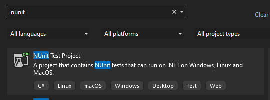
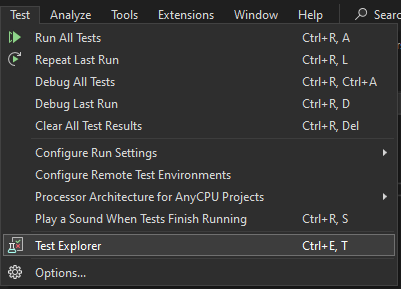
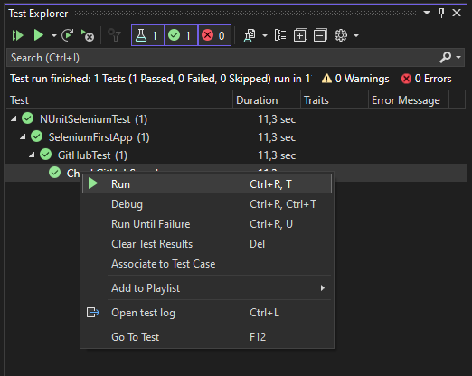
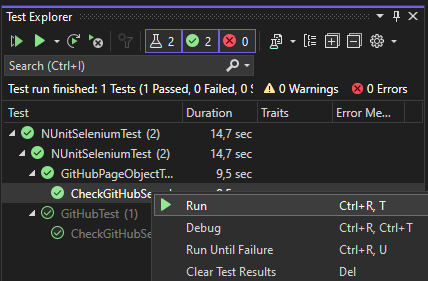

## Selenium with C#

### Used Packages
- [Selenium.WebDriver 4.34.0](https://www.nuget.org/packages/Selenium.WebDriver/4.34.0)
```
    > dotnet add package Selenium.WebDriver --version 4.34.0
```
- [WebDriverManager 2.17.6](https://www.nuget.org/packages/WebDriverManager/2.17.6)
```
    > dotnet add package WebDriverManager --version 2.17.6
```

# NUnit Assertions
- [NUnit 4.3.2](https://www.nuget.org/packages/NUnit/4.3.2)
```
    > dotnet add package NUnit --version 4.3.2
```

## Migrate Selenium Runner - NUnitSeleniumTest







- [Selenium.WebDriver 4.34.0](https://www.nuget.org/packages/Selenium.WebDriver/4.34.0)
```
    > dotnet add package Selenium.WebDriver --version 4.34.0
```
- [WebDriverManager 2.17.6](https://www.nuget.org/packages/WebDriverManager/2.17.6)
```
    > dotnet add package WebDriverManager --version 2.17.6
```

## Page Object

